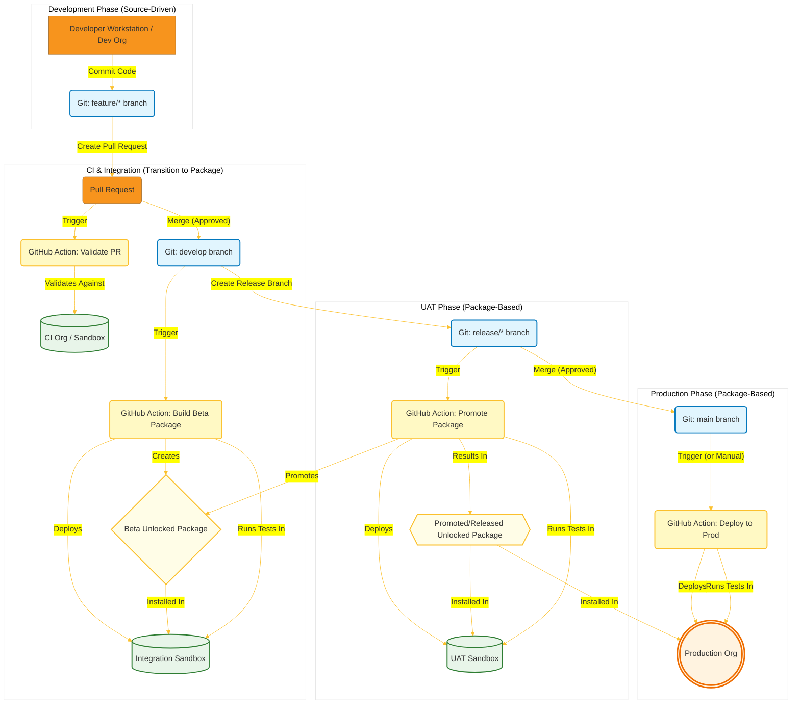
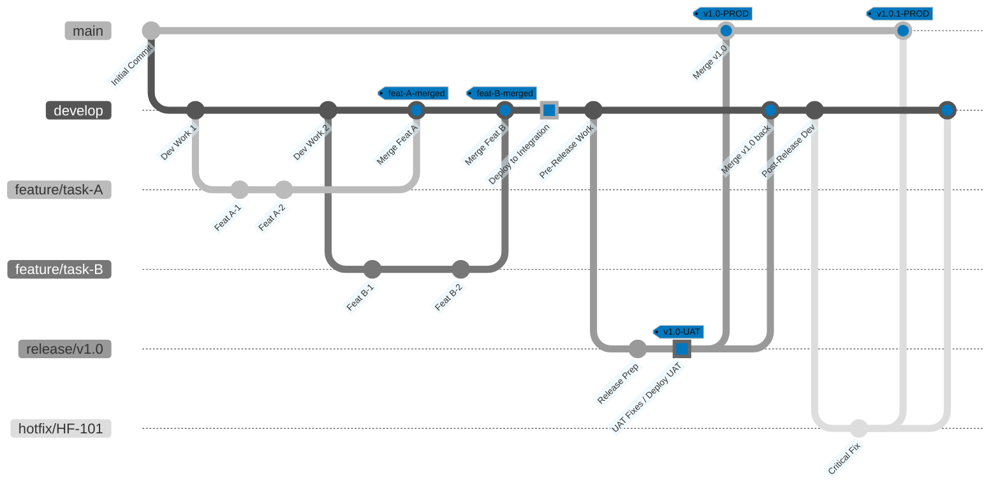

## Core Strategy: Git as the Source of Truth, Package-Centric Releases

**Based on the strategy we outlined:**  ( Gemini Advanced 2.5 Pro (experimental))

- **Integration**: You build **beta unlocked packages** from the develop branch, and then you deploy those packages into the Integration sandbox.
- **UAT/Preprod**: You promote the package version created from the release/* branch, and then you **deploy that promoted (released) package into the UAT sandbox.**
- **Production**: You **deploy the same promoted package that was tested in UAT into Production.**
  
So, while the source for building the packages comes directly from the Git branches (develop, release/*), **the actual deployment artifact pushed into the Integration and UAT sandboxes is the unlocked package, not the raw source code via sf project deploy**. This ensures you are testing the package mechanism early in the cycle.



The branching strategy we've visualized uses specific branches as the source for deployments to those environments, rather than having dedicated branches named after them:

- **Integration Environment**: Code is typically deployed to the Integration sandbox from the develop branch after feature branches are merged in. The diagram indicates this with the **"Deploy to Integration"** commit on the **develop** branch.
- **UAT/Preprod Environment**: Code is deployed to the **UAT** sandbox **from a release/* branch**. The diagram shows this with the **"UAT Fixes / Deploy UAT"** commit on the **release/v1.0** branch.
- **Production Environment**: The main branch itself represents the production-ready code. **Deployments to the Production org happen from the main branch**, typically triggered by merging a **release/*** branch into it. The diagram shows this with the merge to main and the **vX.Y.Z-PROD** tags.

So, the branches in the diagram (develop, release/*, main) correspond to the state of the code that gets deployed to the Integration, UAT, and Production environments, respectively. It's less common to have long-lived Git branches named exactly after the deployment stages themselves in this type of workflow.

# unlocked_package

Let's break down an optimal strategy for Salesforce DevOps using a hybrid approach: source-driven development in Dev orgs, transitioning to unlocked packages for Integration, UAT, and Production, all orchestrated with GitHub Actions.

This model attempts to balance developer speed in early stages with the robustness and modularity of packages for release management. However, as you noted, it presents challenges, primarily around ensuring consistency between the source-based Dev environment and the packaged deployments.

## Core Strategy: Git as the Source of Truth, Package-Centric Releases

- **Source Control (Git/GitHub):** This is non-negotiable. Your Git repository must be the absolute source of truth for all metadata, regardless of where development initially happens.
- **Repository Structure:** Structure your Git repository like an SFDX project from the beginning, even if developers aren't building package versions initially. Define your package directories within sfdx-project.json.

```JSON

// sfdx-project.json example
{
  "packageDirectories": [
    { "path": "force-app/core", "default": false, "package": "CoreServices", "versionName": "ver 0.1", "versionNumber": "0.1.0.NEXT" },
    { "path": "force-app/sales-feature", "default": true, "package": "SalesFeature", "versionName": "ver 0.1", "versionNumber": "0.1.0.NEXT",
      "dependencies": [ {"package": "CoreServices", "versionNumber": "0.1.0.LATEST"} ]
    }
    // Add other package directories as needed
  ],
  "namespace": "", // Usually empty for unlocked packages
  "sfdcLoginUrl": "https://login.salesforce.com",
  "sourceApiVersion": "60.0", // Use the relevant API version
  "packageAliases": {
    "CoreServices": "0Ho...",
    "SalesFeature": "0Ho..."
    // Aliases get filled in when packages are created
  }
}
```

## Development Process:

- Developers work on feature branches checked out from a main development branch (e.g., develop).
- They connect their local VS Code/SFDX CLI to a shared Dev sandbox or individual Dev orgs.
- **Crucially**: Developers use sf project deploy start and sf project retrieve start (or VS Code extensions) to sync metadata between their local, correctly structured SFDX project (cloned from Git) and their assigned Dev org.
- They commit changes to the appropriate package directory within their feature branch in Git.

## Continuous Integration (CI) - Feature Branch/Pull Request:
When a feature branch is pushed or a Pull Request is opened against develop, a GitHub Action should trigger.
Action: Validate the metadata in the PR against a dedicated CI scratch org or sandbox. This catches syntax errors and basic deployment issues early. Run local Apex tests included in the committed source.

## Integration - Merging to develop:
Upon merging a feature branch into develop, a GitHub Action triggers the core packaging and deployment process.
# Action:
  - **Build Beta Package(s):** Create beta versions of the unlocked package(s) defined in sfdx-project.json from the develop branch source code.
  - **Deploy to Integration**: Install these beta package(s) into the Integration environment (a dedicated sandbox).
  - **Run Tests:** Execute Apex tests within the Integration sandbox (potentially a wider set of tests than in CI).

## User Acceptance Testing (UAT) - Release Branch:

When develop is deemed ready for UAT, create a release/ branch (e.g., release/v1.2.0).
- Action (Triggered on release/* branch creation/push):
  - **Promote Package(s)**: Find the last successful beta package version(s) created from the commit lineage now in the release branch and promote them to released status. This locks the package version.
  - **Deploy to UAT**: Install the promoted (released) package version(s) into the UAT sandbox.
  - **Run Tests**: Execute relevant tests in UAT (Apex tests, potentially trigger automated UI tests).

## Production Deployment - Merging to main:

After successful UAT sign-off, merge the release/* branch into main and tag the merge commit (e.g., v1.2.0).
- Action (Triggered on merge to main or manual trigger):
  - **Deploy to Production:** Install the exact same promoted package version(s) that were tested in UAT into the Production org. Use the --target-org ProductionAlias.
  - **Run Tests:** Execute specified Apex tests (often RunLocalTests or a specific suite) in Production.

## GitHub Actions Examples (Conceptual YAML)

You'll need Actions secrets for Dev Hub, Integration, UAT, and Prod org authentication (preferably using JWT Bearer Flow).

### 1. Validate PR (.github/workflows/validate-pr.yml)

```YAML

name: Validate PR Metadata

on:
  pull_request:
    branches: [ develop ]
    paths:
      - 'force-app/**' # Only run if Salesforce metadata changes

jobs:
  validate:
    runs-on: ubuntu-latest
    steps:
    - uses: actions/checkout@v3
      with:
        fetch-depth: 0 # Needed for delta checks if you implement them

    - name: Install Salesforce CLI
      run: |
        npm install --global @salesforce/cli

    - name: Authenticate to CI Org (e.g., Scratch Org or Sandbox)
      run: |
        echo "${{ secrets.SFDX_CI_AUTH_URL }}" > ./SFDX_CI_URL.txt
        sf org login sfdx-url --sfdx-url-file ./SFDX_CI_URL.txt --alias ci-org --set-default

    - name: Validate Metadata Deployment (Quick Check)
      # Use deploy checkonly. Might need delta logic for faster checks on large repos.
      run: sf project deploy validate --source-dir force-app --target-org ci-org --test-level RunLocalTests

    # Optional: Add specific Apex test execution here if needed
```
### 2. Build Beta Package & Deploy to Integration (.github/workflows/deploy-integ.yml)

```YAML

name: Build Beta Package & Deploy to Integration

on:
  push:
    branches: [ develop ]
    paths:
      - 'force-app/**'

concurrency: # Prevent multiple concurrent builds on the same branch
  group: ${{ github.workflow }}-${{ github.ref }}
  cancel-in-progress: true

jobs:
  build_and_deploy:
    runs-on: ubuntu-latest
    steps:
    - uses: actions/checkout@v3

    - name: Install Salesforce CLI
      run: npm install --global @salesforce/cli

    - name: Authenticate to Dev Hub
      run: |
        echo "${{ secrets.SFDX_DEVHUB_AUTH_URL }}" > ./SFDX_DH_URL.txt
        sf org login sfdx-url --sfdx-url-file ./SFDX_DH_URL.txt --alias DevHub --set-default-dev-hub

    - name: Create Beta Package Version(s)
      id: create_package # Give step an ID to access outputs
      run: |
        # Example for one package 'SalesFeature'. Repeat/script for multiple.
        # Consider using JQ/Bash to parse sfdx-project.json for package names
        PACKAGE_NAME="SalesFeature"
        VERSION_INFO=$(sf package version create --package "$PACKAGE_NAME" --installation-key-bypass --wait 20 --code-coverage --version-name "beta-${{ github.sha }}" --tag "${{ github.sha }}" --branch "${{ github.ref_name }}" -x --json)
        echo "Created Package Version Info: $VERSION_INFO"
        PACKAGE_VERSION_ID=$(echo $VERSION_INFO | jq -r .result.SubscriberPackageVersionId)
        echo "PACKAGE_VERSION_ID=$PACKAGE_VERSION_ID" >> $GITHUB_OUTPUT # Store for next step

    - name: Authenticate to Integration Org
      run: |
        echo "${{ secrets.SFDX_INTEG_AUTH_URL }}" > ./SFDX_INTEG_URL.txt
        sf org login sfdx-url --sfdx-url-file ./SFDX_INTEG_URL.txt --alias integ-org

    - name: Install Beta Package in Integration
      run: |
        sf package install --package "${{ steps.create_package.outputs.PACKAGE_VERSION_ID }}" --wait 10 --publish-wait 10 --target-org integ-org

    - name: Run Apex Tests in Integration
      run: |
        # Be specific about which tests to run
        sf apex run test --test-level RunSpecifiedTests --class-names "MySalesFeatureTests,AnotherTestClass" --target-org integ-org --result-format human --synchronous
```

**Let's resolve that tricky part** by replacing the hardcoded package version ID with dynamic logic using sf package version list and jq.

**This script assumes:**

- The package name (e.g., "SalesFeature") is available (here, hardcoded for simplicity, but ideally passed dynamically).
- The beta package creation step included the --branch develop flag (or dynamically ${{ github.ref_name }} if run on the develop branch push).
- jq is available on the runner.

Here's the updated run section for the Promote Package Version(s) step in your deploy-uat.yml (or equivalent) workflow:

```YAML

    - name: Promote Package Version(s)
      id: promote_package
      run: |
        # --- Dynamic Package Version Promotion ---
        # Define the package name. Ideally, get this dynamically (e.g., from sfdx-project.json or workflow inputs)
        PACKAGE_NAME="SalesFeature" # Adjust this to your actual package name

        echo "Attempting to find the latest beta package version for '$PACKAGE_NAME' created from the 'develop' branch..."

        # Query package versions using Salesforce CLI, filtering for the specific package and beta status.
        # Use jq to:
        # 1. Filter results to only include versions created from the 'develop' branch.
        # 2. Sort these versions by CreatedDate in descending order (latest first).
        # 3. Select the SubscriberPackageVersionId (04t...) of the first result (the latest).
        # 4. Handle cases where no matching version is found (output empty string).
        LATEST_BETA_ID=$(sf package version list --packages "$PACKAGE_NAME" --released-status beta --concise --json | \
          jq -r --arg branchName "develop" '
            .result |
            map(select(.Branch == $branchName)) |
            sort_by(.CreatedDate) | reverse | .[0].SubscriberPackageVersionId // empty
        ')

        # Validate that a Package Version ID was actually found
        if [ -z "$LATEST_BETA_ID" ] || [ "$LATEST_BETA_ID" == "null" ]; then
          echo "::error::Could not find a suitable beta package version for '$PACKAGE_NAME' created from the 'develop' branch to promote."
          # Optionally list available versions for debugging:
          # sf package version list --packages "$PACKAGE_NAME" --released-status beta --concise
          exit 1
        fi

        echo "Found latest beta Package Version ID to promote: $LATEST_BETA_ID"

        # Promote the dynamically found package version ID
        echo "Promoting Package Version ID: $LATEST_BETA_ID"
        sf package version promote --package "$LATEST_BETA_ID" --no-prompt

        # Optional: Add a check here to confirm the promotion was successful by querying the package version status again.

        # Output the promoted ID for subsequent steps (like deployment)
        echo "Successfully promoted package version."
        echo "PROMOTED_PACKAGE_VERSION_ID=$LATEST_BETA_ID" >> $GITHUB_OUTPUT
```

**Explanation of Changes:**

- **Package Name**: Defined PACKAGE_NAME. Remember to replace "SalesFeature" with your actual package name or implement a way to determine it dynamically.
- **Query and Filter**: Uses sf package version list with JSON output piped to jq.

## jq Logic:
- Filters the .result array for entries where the Branch property matches "develop".
- Sorts the filtered results by CreatedDate (latest first).
- Takes the first element (.[0]) of the sorted array.
- Extracts its SubscriberPackageVersionId.
- Uses // empty as a fallback in case no matching version is found.
  
- **Validation:** Added an if statement to check if LATEST_BETA_ID is empty or null and exits with an error if no suitable version was found.
- **Uses** ::error:: for better visibility in GitHub Actions logs.
- **Promotion**: Uses the dynamically found $LATEST_BETA_ID in the sf package version promote command.
- **Output**: Sets the PROMOTED_PACKAGE_VERSION_ID output using the dynamic ID.
- 
This approach reliably finds the latest beta package version created from your develop branch, making the promotion step dynamic and removing the need for manual intervention or hardcoding.


### 3. Promote & Deploy to UAT (.github/workflows/deploy-uat.yml)

```YAML

name: Promote Package & Deploy to UAT

on:
  push:
    branches: [ 'release/**' ] # Trigger on pushes to release branches

jobs:
  promote_and_deploy_uat:
    runs-on: ubuntu-latest
    steps:
    - uses: actions/checkout@v3

    - name: Install Salesforce CLI
      run: npm install --global @salesforce/cli

    - name: Authenticate to Dev Hub
      run: |
          echo "${{ secrets.SFDX_DEVHUB_AUTH_URL }}" > ./SFDX_DH_URL.txt
          sf org login sfdx-url --sfdx-url-file ./SFDX_DH_URL.txt --alias DevHub --set-default-dev-hub

    - name: Promote Package Version(s)
      id: promote_package
      run: |
        # --- THIS IS THE TRICKY PART ---
        # You need a reliable way to find the LATEST BETA Package Version ID
        # created from the commit history now in this release branch.
        # Options:
        # 1. Use the tag set during beta creation (if you used --tag <commit_sha>)
        # 2. Query package versions using sf package version list and filter by branch/tag/commit
        # Example using a known beta ID (replace with dynamic lookup logic):
        BETA_PACKAGE_VERSION_ID="04t..." # Get this dynamically!
        echo "Promoting Package Version ID: $BETA_PACKAGE_VERSION_ID"
        sf package version promote --package $BETA_PACKAGE_VERSION_ID --no-prompt
        echo "PROMOTED_PACKAGE_VERSION_ID=$BETA_PACKAGE_VERSION_ID" >> $GITHUB_OUTPUT # Promoted ID is the same

    - name: Authenticate to UAT Org
      run: |
        echo "${{ secrets.SFDX_UAT_AUTH_URL }}" > ./SFDX_UAT_URL.txt
        sf org login sfdx-url --sfdx-url-file ./SFDX_UAT_URL.txt --alias uat-org

    - name: Install Promoted Package in UAT
      run: |
        sf package install --package "${{ steps.promote_package.outputs.PROMOTED_PACKAGE_VERSION_ID }}" --wait 10 --publish-wait 10 --target-org uat-org

    - name: Run Apex Tests in UAT
      run: |
        sf apex run test --test-level RunSpecifiedTests --class-names "MySalesFeatureTests,AnotherTestClass" --target-org uat-org --result-format human --synchronous # Adjust test level/classes for UAT
```

### 4. Deploy to Production (.github/workflows/deploy-prod.yml)

```YAML

name: Deploy Package to Production

on:
  # Option 1: Trigger automatically on merge to main (if release branch was source)
  # push:
  #   branches: [ main ]
  # Option 2: Manual trigger for safety
  workflow_dispatch:
    inputs:
      package_version_id:
        description: 'Promoted Package Version ID (04t...)'
        required: true

jobs:
  deploy_production:
    runs-on: ubuntu-latest
    steps:
    - uses: actions/checkout@v3 # Might not be needed if only installing

    - name: Install Salesforce CLI
      run: npm install --global @salesforce/cli

    - name: Authenticate to Production Org
      run: |
        echo "${{ secrets.SFDX_PROD_AUTH_URL }}" > ./SFDX_PROD_URL.txt
        sf org login sfdx-url --sfdx-url-file ./SFDX_PROD_URL.txt --alias prod-org

    - name: Install Promoted Package in Production
      run: |
        # Use the ID from manual trigger or find it based on the Git tag
        PACKAGE_VERSION_ID="${{ github.event.inputs.package_version_id }}"
        echo "Installing Package ID: $PACKAGE_VERSION_ID"
        sf package install --package "$PACKAGE_VERSION_ID" --wait 10 --publish-wait 10 --security-type AdminsOnly --target-org prod-org # Adjust security type

    - name: Run Apex Tests in Production
      run: |
        # Usually RunLocalTests or specific suites validated in UAT
        sf apex run test --test-level RunLocalTests --target-org prod-org --result-format human --synchronous
```

## Addressing the Challenges:

# Consistency Dev vs. Package: This is the biggest hurdle.
- **Discipline**: Developers must use sf project retrieve to pull changes into the correct package structure locally before committing. Avoid developing components directly in the Dev org UI without syncing back.
- **Validation**: The CI validation step (sf project deploy validate) against a clean org is crucial to catch issues caused by dependencies or metadata existing in the Dev org but not committed to Git.
- **Dependency Definition**: Be meticulous in defining package dependencies in sfdx-project.json. The packaging step (sf package version create) will fail if dependencies aren't met within the codebase being packaged.
- **Metadata Not Packageable**: Maintain these components (e.g., Profiles, Queues, Groups, some Reports/Dashboards) in a separate directory (e.g., unpackaged-metadata). Add steps to your GitHub Actions (after package installation) to deploy this metadata using sf project deploy start --source-dir unpackaged-metadata --target-org <alias>. Manage this carefully, as it bypasses package versioning.
- **Finding the Right Beta Version to Promote:** This requires robust logic. Using Git tags (--tag "${{ github.sha }}" during beta creation) and then querying based on the commit history of the release branch is a common approach. You might query sf package version list --verbose and filter using jq based on the tag or branch.
- This hybrid strategy requires significant team discipline and robust automation to mitigate the risks of divergence between the development environment and the packaged artifacts. Starting development within the package structure from the beginning, possibly using scratch orgs, generally leads to a smoother process, although it might have a steeper initial learning curve.
