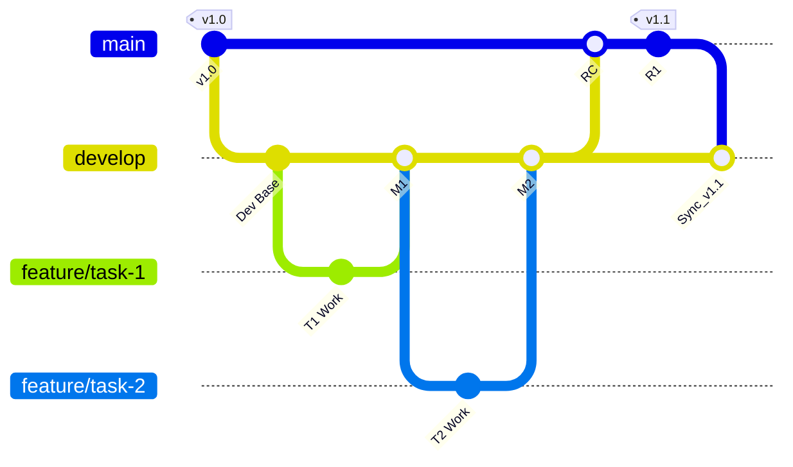
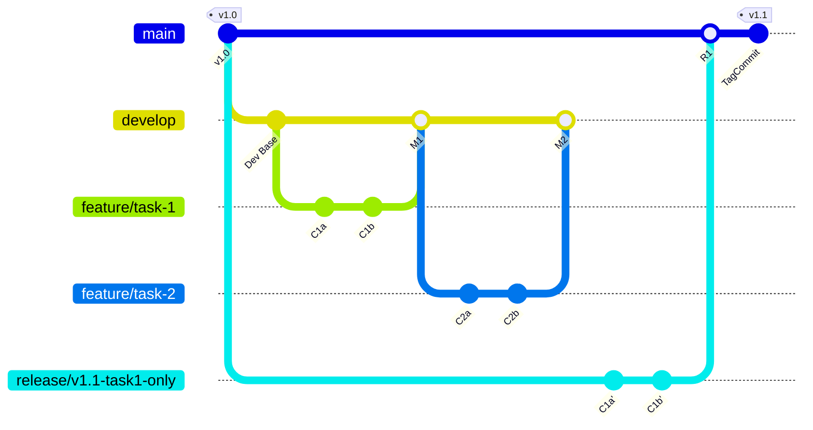

Let's outline two scenarios using a typical GitHub workflow (feature branches \-\> develop \-\> main, using Pull Requests). Both scenarios involve two features (Task 1, Task 2), where Task 1 needs to go to production, but a late decision prevents Task 2 from being included in the *same* immediate release.

**Assumptions:**

* **Branches:** main (Production), develop (Integration), feature/task-1, feature/task-2.  
* **Workflow:** Features are developed on feature/\* branches based on develop. They are merged into develop via Pull Requests (PRs) after review/CI checks. Releases are prepared by merging develop into main (potentially via a release/\* branch, but we'll keep it simpler here for contrast).  
* **Goal:** Release Task 1, but *not* Task 2 in the upcoming production deployment (let's call it v1.1). The current production is v1.0.

---

**Scenario 1: Using git revert (Generally Recommended)**

In this scenario, we accept that develop contains both features, merge it to main (or a release branch) as a candidate, and then explicitly *undo* the changes for Task 2 before finalizing the release.

1. **Initial State:** main is at commit Prod v1.0, develop is synced with main.  
2. **Develop Task 1:**  
   * git checkout develop && git pull origin develop  
   * git checkout \-b feature/task-1  
   * *(Develop code for Task 1, commit changes)*  
   * git push origin feature/task-1  
   * **GitHub:** Create PR from feature/task-1 to develop. CI checks pass, code reviewed, PR merged. develop now contains Task 1 changes. (Let's call the merge commit M1).  
3. **Develop Task 2:**  
   * git checkout develop && git pull origin develop (gets Task 1 changes)  
   * git checkout \-b feature/task-2  
   * *(Develop code for Task 2, commit changes)*  
   * git push origin feature/task-2  
   * **GitHub:** Create PR from feature/task-2 to develop. CI checks pass, code reviewed, PR merged. develop now contains both Task 1 and Task 2 changes. (Let's call the merge commit M2).  
4. **Prepare Release Candidate:**  
   * git checkout main && git pull origin main  
   * git merge develop \--no-ff \-m "Merge develop for Release v1.1 Candidate (includes Task 1, Task 2)" (Merge commit RC)  
   * git push origin main  
   * *(CI/CD deploys main commit RC to Staging/UAT environment)*  
5. **Decision Point:** During UAT or final review, a decision is made: Task 2 cannot go live in v1.1 due to bugs/strategy shift. Task 1 is approved.  
6. **Action (git revert on main):**  
   * git checkout main  
   * Identify the SHA of the merge commit for Task 2 (M2). *Crucially*, we need to find this SHA as it exists *in the history of the main branch* after the RC merge. (Alternatively, revert the RC commit entirely and re-merge develop after fixing it there, but reverting M2 on main is more direct if RC contains only develop's changes). A simpler approach is often to revert on a release branch *before* merging to main, but let's stick to the prompt's direct path for contrast. Let's assume we can reliably identify the changes corresponding to M2 within the main branch history. A safer way: identify the SHA of the merge commit M2 when it happened on develop.  
   * git revert \-m 1 \<SHA\_of\_M2\_merge\_on\_develop\>  
     * \-m 1 specifies the parent number (usually 1 for the first parent, i.e., develop before the merge) when reverting a merge commit.  
     * *(Resolve any conflicts if the revert process requires it)*.  
   * git commit \-m "Revert Task 2 (merge commit \<SHA\_of\_M2\>) for v1.1 release" (Git might create this commit message automatically). Let's call this commit R1.  
   * git push origin main  
7. **Final Release:**  
   * The main branch now contains: Prod v1.0 \+ Task 1 \+ Task 2 \+ Revert of Task 2 \= effectively Prod v1.0 \+ Task 1\.  
   * *(CI/CD can now deploy the latest commit R1 on main to Production)*.  
   * git tag v1.1  
   * git push origin v1.1  
8. **Post-Release Sync:**  
   * Merge main (now at v1.1) back into develop so develop also reflects that Task 2 was reverted for this release.  
     * git checkout develop && git pull origin develop  
     * git merge main \-m "Sync develop with v1.1 release"  
     * git push origin develop  
   * Task 2's code (and its revert) exists in history. If Task 2 needs to be re-introduced later, its original branch might be reworked, or the revert commit (R1) itself could potentially be reverted on develop.

**Mermaid Diagram (Scenario 1 \- Revert):**

---
**Scenario 2: Using git cherry-pick (Generally More Risky/Complex)**

In this scenario, develop contains both features, but realizing Task 2 can't go live, we *ignore* the current state of develop for the release. We create a *new* release branch directly from the last production version (main) and carefully pick *only* the commits related to Task 1 onto it.

1. **Initial State:** main is at commit Prod v1.0, develop is synced with main.  
2. **Develop Task 1:**  
   * git checkout develop && git pull origin develop  
   * git checkout \-b feature/task-1  
   * *(Develop code for Task 1, commit changes \- let's say commits C1a, C1b)*  
   * git push origin feature/task-1  
   * **GitHub:** Create PR from feature/task-1 to develop. PR merged. develop now contains Task 1 changes.  
3. **Develop Task 2:**  
   * git checkout develop && git pull origin develop  
   * git checkout \-b feature/task-2  
   * *(Develop code for Task 2, commit changes \- let's say commits C2a, C2b)*  
   * git push origin feature/task-2  
   * **GitHub:** Create PR from feature/task-2 to develop. PR merged. develop now contains both Task 1 and Task 2 changes.  
4. **Decision Point:** Integration testing on develop (or review) determines Task 2 cannot go live now, but Task 1 must. We decide *not* to merge develop to main.  
5. **Action (git cherry-pick onto a new branch):**  
   * git checkout main  
   * git pull origin main (ensure we are at Prod v1.0)  
   * git checkout \-b release/v1.1-task1-only (Create a *new* branch from production state)  
   * Identify the specific commit SHAs for Task 1 (C1a, C1b). This requires careful inspection of feature/task-1 or develop's history.  
   * git cherry-pick \<SHA\_of\_C1a\>  
   * git cherry-pick \<SHA\_of\_C1b\>  
     * *(Resolve any conflicts during cherry-picking. Conflicts might arise if these commits depended on prior changes in develop that are not on main)*.  
   * git push origin release/v1.1-task1-only  
6. **Final Release Prep & Deployment:**  
   * The release/v1.1-task1-only branch now contains Prod v1.0 \+ (new copies of) Task 1 commits. It does *not* contain Task 2\.  
   * *(Deploy this branch to Staging/UAT for final verification)*.  
   * **GitHub:** Create PR from release/v1.1-task1-only to main. Review carefully (ensure only Task 1 changes are present relative to main). Merge the PR.  
7. **Final Release:**  
   * The main branch now contains Prod v1.0 \+ Task 1's changes (via the cherry-picked commits).  
   * *(CI/CD deploys the merge commit on main to Production)*.  
   * git tag v1.1  
   * git push origin v1.1  
8. **Post-Release Sync (Problematic):**  
   * develop *still contains the original Task 1 merge AND the Task 2 merge*.  
   * Merging main (v1.1) back to develop is now complex:  
     * Git might see the original Task 1 merge on develop and the cherry-picked Task 1 changes on main as divergent, potentially leading to conflicts.  
     * Task 2 is still present on develop and will be included in the *next* release unless explicitly reverted there.  
   * This divergence is a significant drawback of cherry-picking for releases. You often *still* need to go back and revert Task 2 from develop to keep things sane.

**Mermaid Diagram (Scenario 2 \- Cherry-Pick):**

---
**Conclusion:**

* **Scenario 1 (Revert):** Generally preferred. It maintains a clearer history of decisions (feature merged, then reverted). It keeps the main branches (develop, main) more aligned, simplifying future merges. While the history shows the revert, it's accurate and traceable.  
* **Scenario 2 (Cherry-Pick):** Creates a superficially "cleaner" release branch but introduces significant risks: missing commits, handling dependencies incorrectly, and creating divergence between develop and main that complicates future work. It's often more complex and error-prone than reverting and should typically be avoided for constructing releases from multiple features.
